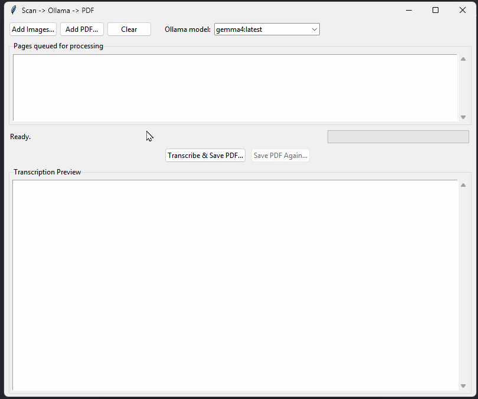

# Scan → Ollama → PDF

A desktop app that sends scanned handwritten documents directly to a local [Ollama](https://ollama.com) vision model (default: `gemma4`) and saves the transcription as a plain-text PDF.



## Requirements

- Python 3.10+
- [Ollama](https://ollama.com) running locally with a vision-capable model pulled (e.g. `ollama pull gemma4`)

## Installation

```bash
pip install requests pillow fpdf2 pypdfium2
```

## Usage

```bash
python handwriting_app.py
```

1. Click **Add Images…** to queue one or more scanned image files (PNG, JPG, BMP, TIFF), or **Add PDF…** to queue a scanned PDF.
2. Select the Ollama model from the dropdown (auto-populated from your local instance).
3. Click **Transcribe & Save PDF…**, choose an output path, and wait while each page is processed.
4. The transcription is shown in the preview pane and saved as a PDF.
